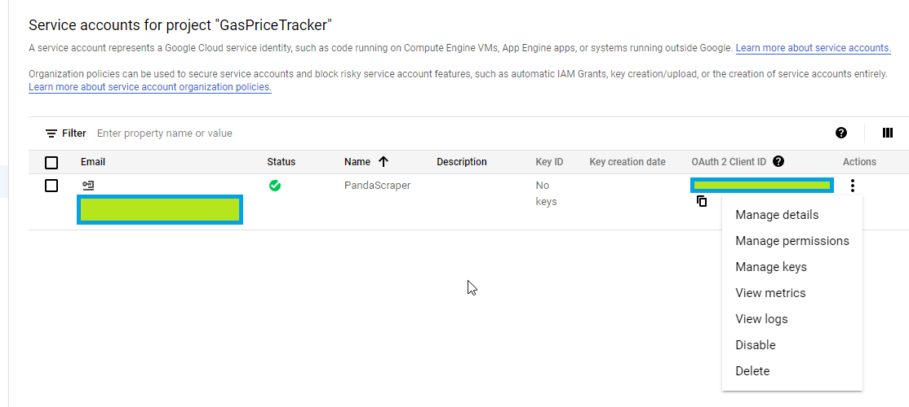
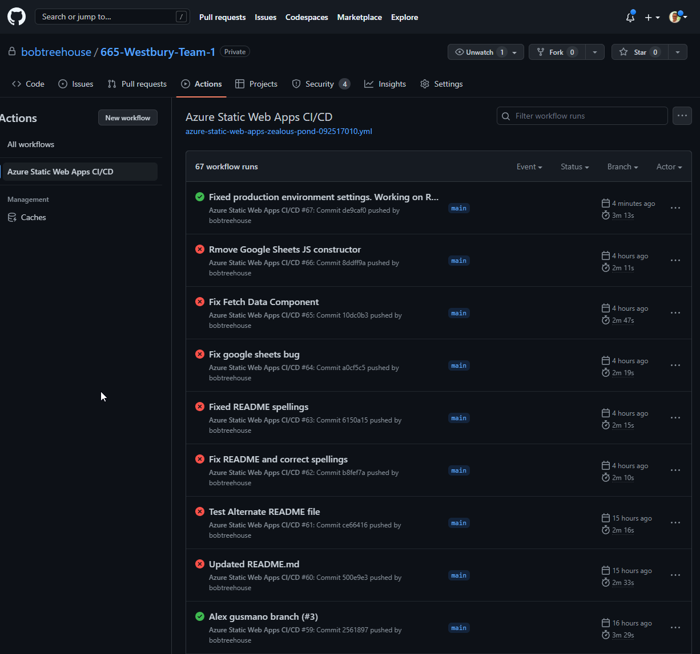
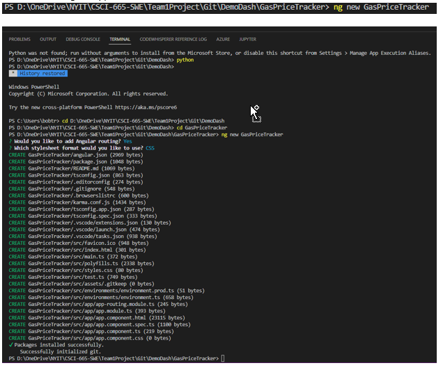
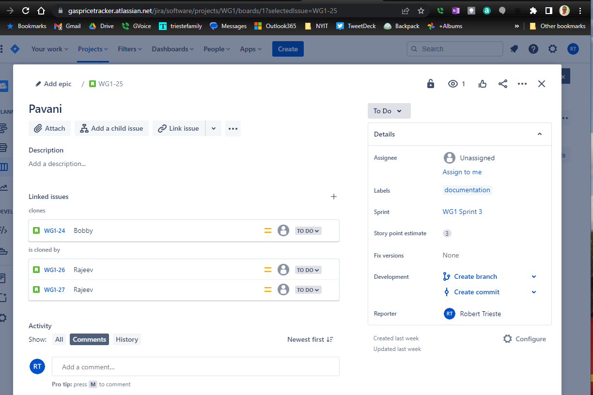
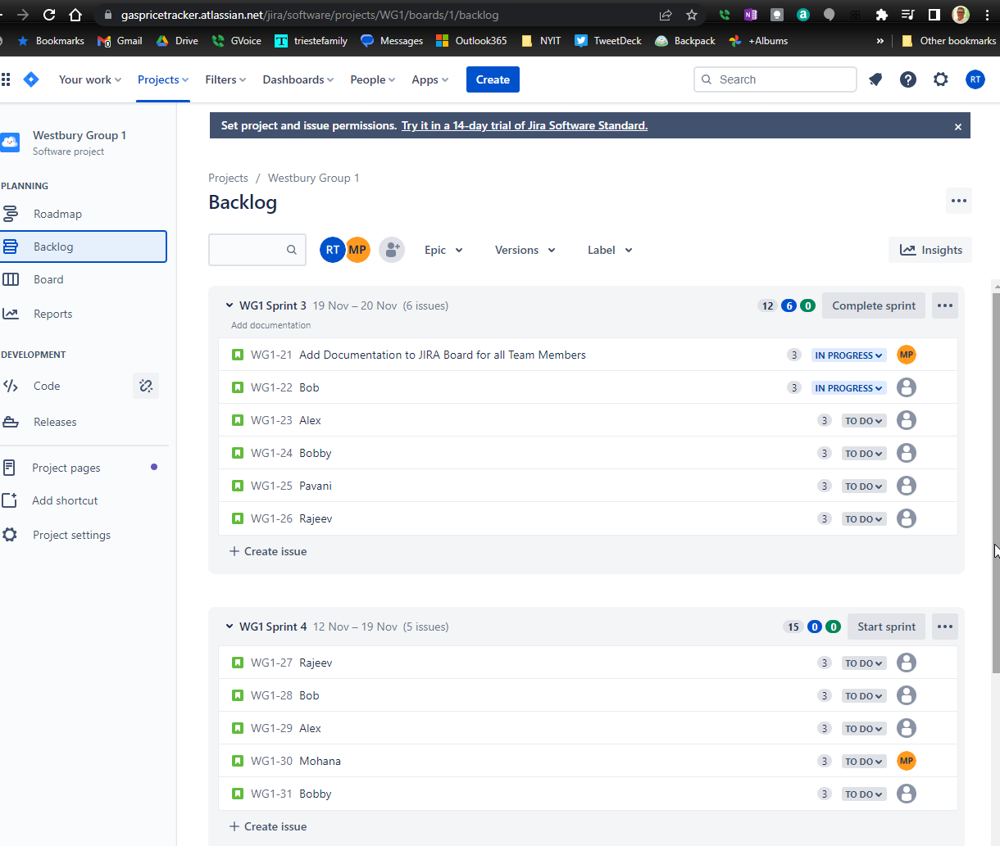

<h2 style="text-align: center;">USA Gas Price Tracker App - NYIT Westbury Team 1</h2>

<strong> CSCI 665 NYIT Fall 2022 - Professor Altion Simo</strong>

**Team Members**  
 1. Robert Trieste	rtrieste@nyit.edu	917-806-6333 
 2. Alex Gusmano	agusmano@nyit.edu	516-382-0856 
 3. Mohana Pranadeep Potti	mpotti@nyit.edu	315-737-1799 
 4. Pavani Gummadi pgumma01@nyit.edu	848-345-0235 
 5. Venkata Ratna Sandeep Paladugu	vpalad03@nyit.edu	315-737-1415 
 6. Rajeev Gurram	rgurra07@nyit.edu	973-641-9942 

- <a href="#AppHighlights">Application Highlights</a> 
- <a href="#UseOfCloud">Use of Cloud</a> 
- <a href="#ProjectStructure">Project Structure</a> 
- <a href="#Backend">Backend</a> 
- <a href="#Frontend">Frontend</a> 
- <a href="#TeamMeetings">Team Meetings</a> 
- <a href="#Jira">Jira</a> 
- <a href="#Confluence">Confluence</a> 

<strong>Some highlights of this application:</strong>

  <ul>
  <li>This Angular SPA (Single-Page Web Application - with multiple components) was concieved and built by the members listed above in the Fall of 2022 in conjuction with NYIT's CSCI 665 Software Engineering Course taught by Professor Altion Simo.
  </li>

  <li>The project was as much about team colllaboration and the iterative process of building software as it was about delivering a functioning app.
  </li>

  <li>Right from the start the Team had to consider the pros and cons of building a web app versus a native mobile application.</li>

  <li>Although native mobile apps have some advantages such as: running faster than web apps in some cases; greater functionality as they have access to system resources; can work offline, etc, the team chose to build a web app due to their inherent advantages such as: web apps do not need to be downloaded or installed; function in-browser; easy to maintain as they have a common codebase regardless of mobile platform; do not require app store approval, etc.</li>

  <li>During 2022 the US much like the rest of the World saw oil and gasoline prices spike. As this was maintstream economic news with implications for an already delicate supply-chain (diesel fule has a direct impact on the the end price of goods and services here in the United States) the Team decided to build an app that would easily show gasoline prices across the coutry. 
  </li>

  <li>Our USA Gas Price Tracker employs a python backend that collects publicly-available gas price data published by the American Automobile Association.</li>

  <li>The app adds a data visualization layer by presenting the gas prices by state in a heatmap (chloropleth) with the help of open-source python-based library Plotly and Chart-Studio. This is a great open-source alternative to software such as Tableau and MSFT's Power BI which can become expensive</li>

  <li>The raw data collected is written to and stored in Google Cloud Platform (Google Sheets) as this is a more economical set-up than using a fully-fledged RDBMS such as SQL Server.
  </li>

  <li>Some of the main sticking points and more time-consuming portions of building this app were getting the various platforms and services talking to one another: such as extracting Google credentials and getting the AWS-EC2 hosted python apps talking through the Google Sheets API with their service account authentication:  
  </li>
   

  
   
  <li>Once things were up and runnnig the Angular frontend made for an efficient presentation layer. By use of backend running timed CRON jobs on the server 
  the app runs by itelf and collects and presents new fresh data daily.   
  </li> 
   </ul>

<strong>Use of the Cloud - Touch all 3 major Cloud Platforms:</strong>

<ul>
  <li>We utilize <strong>infrastructure from all three major cloud providers</strong>: </li>

  <li><a href='https://aws.amazon.com/' target="_blank" rel="noopener">Amazon AWS</a>
    for the backend to host a Linux EC2 instance. </li>

  <li><a href='https://cloud.google.com/' target="_blank" rel="noopener">Google Cloud Platform (GCP)</a> service account
    to host the dataframe
    produced.</li>

  <li><a href='https://azure.microsoft.com/en-us/' target="_blank" rel="noopener">Microsoft Azure</a> to host and run
    our static web app with a
    <a href='https://learn.microsoft.com/en-us/azure/static-web-apps/build-configuration?tabs=github-actions'
      target="_blank" rel="noopener">CI/CD</a>
    pipeline through <a href='https://github.com/' target="_blank" rel="noopener">Git Hub.</a>
  </li>
  </ul>

<strong>Constructing the application:</strong>

  <ul>
  <li>Built with <a href='https://visualstudio.microsoft.com/downloads/' target="_blank" rel="noopener">Visual Studio
      Code</a> and</li>

  <li><a href='https://angular.io/' target="_blank" rel="noopener">Angular</a> utilizing <a
      href='http://www.typescriptlang.org/' target="_blank" rel="noopener">TypeScript</a> for
    client-side code.</li>

  <li>VS Code has Angular CLI integration. In development mode, there's no need to run
    <code>ng serve</code>.
     It runs in the background automatically, so your client-side resources are dynamically built
    on demand and the page refreshes  when you modify any file.
  </li>

  <li>Efficient production builds. In production mode, development-time features are disabled, and
    your <code>dotnet publish</code> configuration  automatically invokes <code>ng build</code> to produce minified,
    ahead-of-time compiled JavaScript files.
  </li>

  <li>By hosting our application as a Microsoft Azure Static Web App and utilizing GutHub as the codebase repositiory,  
  we can build with CI/CD through Git Hub actions and employ "Red to Green" development.</li>
 

  
  </ul>

<strong>Backend:</strong>

  <ul>
  <li>The process kicks off daily with <a href='https://en.wikipedia.org/wiki/Cron' target="_blank" rel="noopener">CRON
    </a>scheduler in EC2 running <a href='https://www.python.org/' target="_blank" rel="noopener">Python</a>
    scripts that collect publicly-available gas price data published   by the American Automobile Association</li>

  <li>The first Python script scrapes the gas price data from the web and writes it as a CSV file to Google Sheets
    through the API with credentials.</li>

  <li>The second Python script reads that CSV into a <a href='https://wesmckinney.com/pages/about.html' target="_blank"
      rel="noopener">Pandas
      dataframe</a> and then uses the open source charting Python library <a href='https://en.wikipedia.org/wiki/Plotly'
      target="_blank" rel="noopener">Plotly</a> to create the choropleth heatmap.</li>

  <li><a href='https://pypi.org/' target="_blank" rel="noopener">Libraries</a> such as Beautiful Soup, Pandas, Pydrive,
    Google Auth, and Google Sheets
    API help accomplish all of this and
    employ the  software engineering concept of efficient reuse.</li>
</ul>

<strong>Frontend:</strong>

  <ul>
  <li><a href='https://angular.io/' target="_blank" rel="noopener">Angular</a> utilizing <a
      href='http://www.typescriptlang.org/' target="_blank" rel="noopener">TypeScript</a> for
    client-side code. In VS Code creating the app and adding components with Angular 'ng build' directives.</li>
   

   

  <li>The Plotly chart is hosted in <a href='https://chart-studio.plotly.com/feed/#/' target="_blank"
      rel="noopener">Chart-Studio</a> from where it is
    then
    embedded into our site through the Angular front end.
  </li>

  <li><a href='http://getbootstrap.com/' target="_blank" rel="noopener">Bootstrap</a> for layout and styling.
  </li>
  </ul>

<strong>Team Meetings:</strong>

<ul>
<li>Ran Angular Test(s)
Found Error caused by Change in title (addition of spaces)
Ex:"USAGasPriceTracker" -> "USA Gas Price Tracker"
Error is purely cosmetic and negligable when it comes to function of the code.
</li>

<li>Also went over how the project works from Frontend To Backend
</li>

<li>Discussed Readme Documentation as well as project FrontEnd to BackEnd Functionality
Guided Pranadeep as to how to formatt README.md
</li>

<li>Our team meet via Zoom video conference and used a private WhatsApp Group to schedule meetings.
 - We discussed **iterative** approach to building the project.
   </li>
  </ul>
 

<strong>Jira:</strong>

<ul>
<li>We utilized Jira boards <a href='https://www.atlassian.com/software/jira/guides/getting-started/overview#:~:text=Jira%20helps%20teams%20plan%2C%20assign,1%20tool%20for%20agile%20teams' target="_blank" rel="noopener">(Atlassian Software)</a> to add and assign tasks and track progress and backlog. 
</li>
</ul>
 

<strong>Confluence:</strong>

<ul>
<li>We utilized Confluence pages <a href='https://www.atlassian.com/software/confluence/guides/get-started/confluence-overview#hosting-options' target="_blank" rel="noopener">(Atlassian Software)</a> to log supporting reaserch and construct our own 'How-To's' for team knowledge sharing. 
</li>
</ul>
 

- <a href="#WestburyTeam1">Back to Top</a> 

 