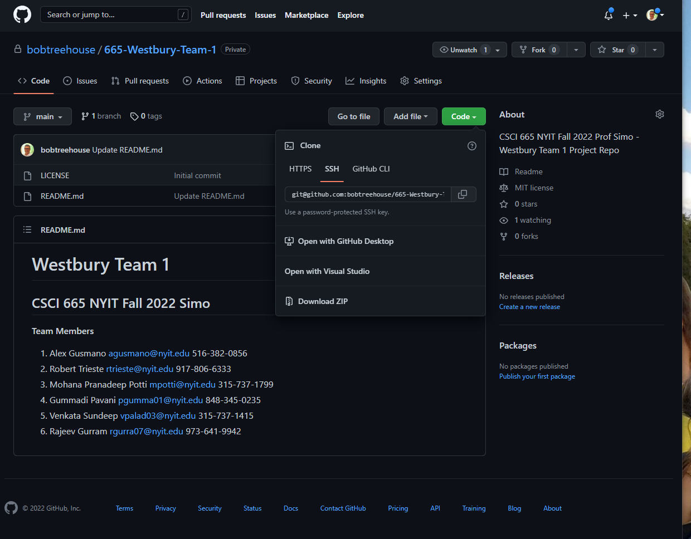

# Westbury Team 1 
## CSCI 665 NYIT Fall 2022 Simo


**Team Members** <br>
 1. Alex Gusmano	agusmano@nyit.edu	516-382-0856<br>
 2. Robert Trieste	rtrieste@nyit.edu	917-806-6333<br>
 3. Mohana Pranadeep Potti	mpotti@nyit.edu	315-737-1799<br>
 4. Gummadi Pavani	pgumma01@nyit.edu	848-345-0235<br>
 5. Venkata Sundeep	vpalad03@nyit.edu	315-737-1415<br>
 6. Rajeev Gurram	rgurra07@nyit.edu	973-641-9942<br>


- <a href="#TeamMeetings">Team Meetings</a><br>
- <a href="#Jira">JIRA</a><br>
- <a href="#Confluence">Confluence</a><br>
- <a href="#ProjectStructure">Project Structure</a><br>

<p><a name="TeamMeetings"></a></p>

### Our team meet via Zoom video conference and used a private WhatsApp Group to schedule meetings.
 - We discussed **iterative** approach to building the project.

# Sept 28 First Team Meeting

Went over ideas.

https://git-scm.com/downloads
    

We created a GitHub repo to house our code - starting with this **README.md** file


```python
from IPython.core.display import Image, display
PATH = "D:/OneDrive/NYIT/CSCI-665-SWE/Team1Project/Git/READMEscreenshots/"
display(Image(filename = PATH + "Westbury-Team-1_ CSCI 665 NYIT Fall 2022 Prof Simo - Westbury T.png", width=850, height=1100))
```





```python
from IPython.core.display import Image, display
PATH = "D:/OneDrive/NYIT/CSCI-665-SWE/Team1Project/Git/READMEscreenshots/"
display(Image(filename = PATH + "Nov19_TeamMeeting.png", width=850, height=1100))

```


<p><strong>Some highlights of this application:</strong></p>

<ul>
  <li>We utilize <strong>infrastructure from all three major cloud providers</strong>: </li>

  <li><a href='https://aws.amazon.com/' target="_blank" rel="noopener">Amazon AWS</a>
    for the backend to host a Linux EC2 instance. </li>

  <li><a href='https://cloud.google.com/' target="_blank" rel="noopener">Google Cloud Platform (GCP)</a> service account
    to host the dataframe
    produced.</li>

  <li><a href='https://azure.microsoft.com/en-us/' target="_blank" rel="noopener">Microsoft Azure</a> to host and run
    our static web app with a
    <a href='https://learn.microsoft.com/en-us/azure/static-web-apps/build-configuration?tabs=github-actions'
      target="_blank" rel="noopener">CI/CD</a>
    pipeline through <a href='https://github.com/' target="_blank" rel="noopener">Git Hub.</a>
  </li>

  <li>Built with <a href='https://visualstudio.microsoft.com/downloads/' target="_blank" rel="noopener">Visual Studio
      Code</a> and</li>

  <li><a href='https://angular.io/' target="_blank" rel="noopener">Angular</a> utilizing <a
      href='http://www.typescriptlang.org/' target="_blank" rel="noopener">TypeScript</a> for
    client-side code.</li>

  <li>VS Code has Angular CLI integration. In development mode, there's no need to run
    <code>ng serve</code>.
    <br>It runs in the background automatically, so your client-side resources are dynamically built
    on demand and the page refreshes <br>when you modify any file.
  </li>

  <li>Efficient production builds. In production mode, development-time features are disabled, and
    your <code>dotnet publish</code> configuration <br>automatically invokes <code>ng build</code> to produce minified,
    ahead-of-time compiled JavaScript files.
  </li>

  <li><a href='http://getbootstrap.com/' target="_blank" rel="noopener">Bootstrap</a> for layout and styling.</li>

  <li>The process kicks off daily with <a href='https://en.wikipedia.org/wiki/Cron' target="_blank" rel="noopener">CRON
    </a>scheduler in EC2 running <a href='https://www.python.org/' target="_blank" rel="noopener">Python</a>
    scripts that collect publicly-available gas price data published <br> by the American Automobile Association</li>

  <li>The first Python script scrapes the gas price data from the web and writes it as a CSV file to Google Sheets
    through the API with credentials.</li>

  <li>The second Python script reads that CSV into a <a href='https://wesmckinney.com/pages/about.html' target="_blank"
      rel="noopener">Pandas
      dataframe</a> and then uses the open source charting Python library <a href='https://en.wikipedia.org/wiki/Plotly'
      target="_blank" rel="noopener">Plotly</a> to create the choropleth heatmap.</li>

  <li>The Plotly chart is hosted in <a href='https://chart-studio.plotly.com/feed/#/' target="_blank"
      rel="noopener">Chart-Studio</a> from where it is
    then
    embedded into our site through the Angular front end.</li>

  <li><a href='https://pypi.org/' target="_blank" rel="noopener">Libraries</a> such as Beautiful Soup, Pandas, Pydrive,
    Google Auth, and Google Sheets
    API help accomplish all of this and
    employ the <br>software engineering concept of efficient reuse.</li>
</ul>


```python

```
